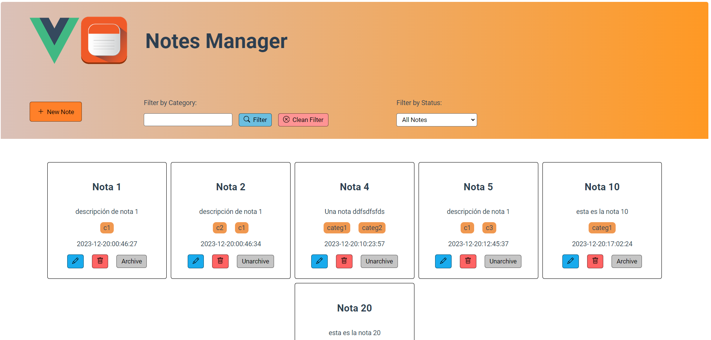

# Tomador de Notas (Proyecto SPA)

## Captura de Pantalla

**Frontend pendiente para mejorar**



## Stack y Versiones

### Backend

Todo fue desarrollado utilizando Java con IntelliJ IDE, y la configuración de Spring Boot se estableció desde https://start.spring.io/.

- Java 17
- Maven
- Spring Boot 3.2.1
- Dependencias: Spring Data JPA, Lombok, Controlador MySQL, Spring Web, Spring Security (todas las dependencias se enumeran en formato XML en `dependencies.md`)
- MySQL 8.0

### Frontend

El framework utilizado es Vue.js. La versión de npm es 10.2.4 y la versión de node es 21.4.0.

- Vue 3.3.12
- axios 1.6.2
- core-js 3.8.3

## Ejecución de la Aplicación

**Paso 1.** Clona el repositorio en tu entorno local (`git clone ...`).

**Paso 2.** Abre el archivo `config_database.txt` y reemplaza el nombre de usuario y la contraseña con tus credenciales de MySQL (MySQL debe estar instalado).

**Paso 3.** Abre el archivo `config_app_properties.txt` y reemplaza solo las siguientes tres líneas:

```properties
spring.datasource.url=jdbc:mysql://[nombre del host/dirección IP]:[tu puerto]/notes?useTimezone=true&serverTimezone=UTC

spring.datasource.username=[tu nombre de usuario]

spring.datasource.password=[tu contraseña]
```

Reemplaza solo los campos dentro de `[]` con tus credenciales, IP y puerto.

**Paso 4.** Ejecuta el archivo `execute.sh`. Este script crea la base de datos `notes`, configura `application.properties`, ejecuta el Backend y finalmente el Frontend.

**Notas:**

Si la base de datos no se crea utilizando el script de shell debido a problemas de permisos o si el comando `mysql` no es reconocido, ejecuta amablemente `CREATE DATABASE notes;` en MySQL Workbench o en una consola de MySQL con privilegios de administrador.

Si hay una advertencia al ejecutar el backend, es decir, si no se ejecuta, ejecuta manualmente desde un IDE (IntelliJ, Eclipse) el archivo `AppApplication.java` ubicado en `backend/src/main/java/com/notes/app`.
Espero que esto no cause demasiados problemas. Gracias de antemano.

## Otro método de ejecución

**Sigue los pasos 1 a 3 descritos anteriormente luego...**

**Paso 1.** Ejecuta manualmente desde un IDE (IntelliJ, Eclipse) el archivo `AppApplication.java` ubicado en `backend/src/main/java/com/notes/app`.

Asegurate de limpiar y volver a instalar las dependencias: `mvnw clean`, `mvnw install`.

**Paso 2.** Ejecuta manualmente el proyecto de vue desde `frontend/`: `npm install`, `npm run serve`